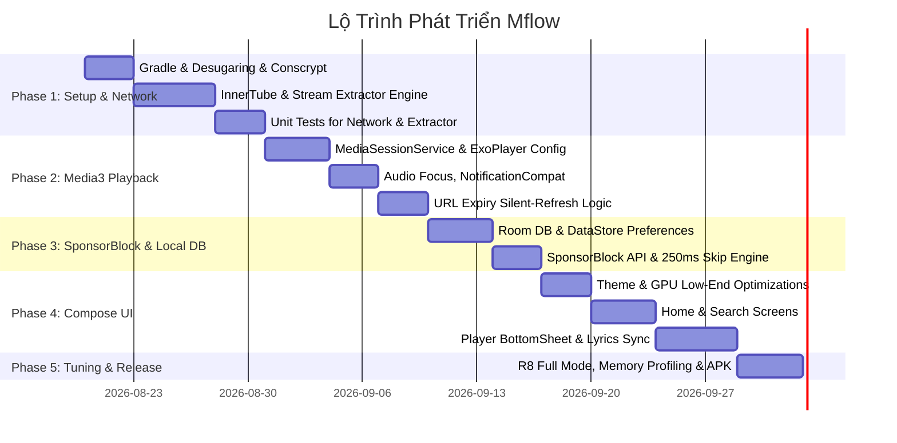

# Kế Hoạch Triển Khai Ứng Dụng Mflow (com.lobie.mflow)

## 1. Tổng Quan Dự Án (Project Overview)
- **Tên ứng dụng**: Mflow
- **Package Name**: `com.lobie.mflow`
- **Nền tảng mục tiêu**: `minSdk = 24` (Android 7.0 Nougat), `targetSdk = 34` (Android 14)
- **Mục tiêu**: Xây dựng ứng dụng nghe nhạc trực tuyến hiệu năng cao từ nguồn YouTube/YouTube Music, phát nền ổn định, tự động bỏ qua quảng cáo/đoạn thừa qua SponsorBlock, giao diện Jetpack Compose mượt mà và tiết kiệm RAM tối đa cho các thiết bị Android đời cũ (API 24).

---

## 2. Kiến Trúc Hệ Thống (Architecture Overview)

```mermaid
graph TD
    UI[Jetpack Compose UI (MVI / MVVM)] --> VM[ViewModels & UI StateFlow]
    VM --> Domain[Domain Layer / UseCases]
    Domain --> Repo[Repository Layer]
    
    subgraph Data Layer
        Repo --> LocalDB[(Room Database / DataStore)]
        Repo --> RemoteAPI[InnerTube / Stream Extractor]
        Repo --> SponsorAPI[SponsorBlock Client]
    end

    subgraph Network & Security (Android 7 Safe)
        RemoteAPI --> OkHttpEngine[OkHttp Engine + Conscrypt TLS 1.3]
        SponsorAPI --> OkHttpEngine
    end

    subgraph Playback Subsystem
        VM --> MediaController[Media3 MediaController]
        MediaController <--> MediaService[MflowMediaSessionService]
        MediaService --> ExoPlayer[ExoPlayer Engine]
        MediaService --> SBHandler[SponsorBlock Auto-Skip Handler]
        MediaService --> TokenRefresher[Silent URL Refresh on 403]
        MediaService --> NotifProvider[MediaNotificationProvider (API 24+)]
    end
```

---

## 3. Lộ Trình Triển Khai Chi Tiết Theo Sprint (Phased Plan)



### Giai Đoạn 1: Cấu Hình Dự Án, Core Network & Trích Xuất Dữ Liệu
1. **Khởi tạo Gradle Project & Desugaring**:
   - `compileSdk = 34`, `minSdk = 24`, `targetSdk = 34`.
   - Bật `coreLibraryDesugaring("com.android.tools:desugar_jdk_libs:2.0.4")`.
   - Tích hợp `org.conscrypt:conscrypt-android:2.5.2` để nạp TLS 1.3 và Root CA hiện đại (tránh SSLHandshakeException trên Android 7).
2. **Network Layer (Ktor + OkHttp Engine)**:
   - Cấu hình Ktor Client với OkHttp Engine sử dụng Conscrypt Security Provider.
   - Thêm Interceptors xử lý User-Agent, Headers giả lập YouTube Music / InnerTube client.
3. **Stream Extractor Module**:
   - Tích hợp bộ parser trích xuất audio stream (itag 140 m4a / itag 251 opus).
   - Module lấy metadata: bài hát, nghệ sĩ, album, gợi ý tìm kiếm, trending quick picks.
4. **Deliverable Phase 1**: Unit test chạy độc lập lấy metadata JSON và giải mã stream audio URL thành công.

---

### Giai Đoạn 2: Lõi Phát Nhạc Nền với AndroidX Media3
1. **MediaSessionService Architecture**:
   - Tạo `MflowMediaSessionService` kế thừa `MediaSessionService` (`androidx.media3:media3-session`).
   - Quản lý vòng đời Foreground Service tương thích Android 7.0 đến Android 14 (bao gồm quyền `FOREGROUND_SERVICE_MEDIA_PLAYBACK` trên API 34).
2. **ExoPlayer Low-RAM Optimization**:
   - Cấu hình `DefaultLoadControl`:
     - Min buffer: 15.000 ms (15s).
     - Max buffer: 50.000 ms (50s).
     - Buffer for playback: 2.500 ms.
     - Buffer for playback after rebuffer: 5.000 ms.
   - `DefaultRenderersFactory` bật `audioOffload` nếu phần cứng hỗ trợ để giảm tải CPU/pin.
3. **Silent Token Refresh (Khắc Phục URL Expiration / 403 Forbidden)**:
   - Trong `Player.Listener.onPlayerError`, bắt `PlaybackException` có mã lỗi HTTP 403 (`ERROR_CODE_IO_BAD_HTTP_STATUS`).
   - Tự động gọi API lấy URL stream mới, thay thế MediaItem tại vị trí phát hiện tại (`currentPosition`) mà không làm gián đoạn trải nghiệm người dùng.
4. **Audio Focus & Notification**:
   - Quản lý Audio Focus: tự động giảm âm lượng (ducking) khi có chuông thông báo, tạm dừng khi có cuộc gọi đến.
   - Custom `MediaNotificationProvider` sử dụng `NotificationCompat.Builder` hiển thị ảnh thumbnail, nút Next/Previous/Play/Pause, tương thích trơn tru trên Android 7.

---

### Giai Đoạn 3: Tích Hợp SponsorBlock & Cơ Sở Dữ Liệu Nội Bộ
1. **Room Database & Local Storage**:
   - `SongEntity`, `HistoryEntity`, `FavoriteEntity`, `PlaylistEntity`.
   - `SongDao`, `HistoryDao`, `FavoriteDao`.
   - Quản lý cài đặt ứng dụng bằng Jetpack DataStore (chất lượng âm thanh, bật/tắt thể loại SponsorBlock, chế độ tiết kiệm dữ liệu).
2. **SponsorBlock Client & Skip Logic**:
   - Gọi endpoint `https://sponsor.ajay.app/api/skipSegments?videoID={id}&categories=["sponsor","intro","outro","music_offtopic","preview"]`.
   - Lưu cache các phân đoạn `[start, end]` trong bộ nhớ tạm của bài hát đang phát.
   - Xây dựng `SponsorBlockSkipHandler`: Polling định kỳ mỗi 250ms bằng Coroutine Flow gắn liền với vòng đời Playback hoặc hook vào `Player.Listener.onPositionDiscontinuity`.
   - Khi `player.currentPosition` nằm trong khoảng `[start, end]`, tự động gọi `player.seekTo(end)` kèm notification/toast nhỏ thông báo cho người dùng.

---

### Giai Đoạn 4: Giao Diện Jetpack Compose & Tối Ưu GPU Yếu
1. **Tối ưu hóa Compose cho GPU Android 7 (Mali-T / Adreno 5xx)**:
   - Gắn annotation `@Immutable` và `@Stable` trên toàn bộ UI state model để loại bỏ recomposition không cần thiết.
   - Tuyệt đối không dùng `Modifier.blur()` (gây crash hoặc sụt giảm FPS nghiêm trọng trên GPU cũ).
   - Hạn chế bóng đổ phức tạp (`Modifier.shadow`), sử dụng border nhẹ hoặc tông màu phân cấp.
   - Áp dụng `derivedStateOf` cho các trạng thái cuộn danh sách (LazyList scroll state).
2. **Cấu trúc màn hình**:
   - **HomeScreen**: Banner Quick Picks, Danh sách nghe gần đây, Trending Charts.
   - **SearchScreen**: Search bar với Instant Suggestions, Filter chips (Song, Video, Playlist, Artist).
   - **PlayerScreen**:
     - Mini Player dạng BottomSheet neo ở đáy màn hình.
     - Fullscreen Player với đĩa xoay / thumbnail lớn, thanh Seekbar mượt, nút Skip Sponsor indicator.
     - Synced Lyrics View (lời bài hát chạy theo thời gian thực).
3. **Coil Image Loading**:
   - Cấu hình Coil ImageLoader với bộ nhớ đệm bitmap `RGB_565` (thay vì `ARGB_8888`) nhằm giảm 50% dung lượng RAM sử dụng khi render thumbnail.

---

### Giai Đoạn 5: Tối Ưu Hóa Bộ Nhớ, R8 Full Mode & Đóng Gói
1. **R8 Full Mode & Proguard**:
   - Kích hoạt `android.enableR8.fullMode=true` trong `gradle.properties`.
   - Viết quy tắc Proguard cho Ktor, Conscrypt, Room, Media3 và Kotlinx Serialization để tối ưu kích thước file APK nhỏ gọn nhất.
2. **Profiling & Memory Leak Prevention**:
   - Triệt tiêu memory leak giữa Service - Controller - UI (sử dụng WeakReference hoặc giải phóng `MediaController` trong `onCleared`/`onDispose`).
3. **Đóng gói APK Release**.

---

## 4. Cấu Trúc Thư Mục Chi Tiết (Project Directory Structure)

```
app/src/main/java/com/lobie/mflow/
├── MflowApplication.kt               # Khởi tạo Conscrypt, DI/Koin, Notification channels
├── data/
│   ├── api/
│   │   ├── KtorClientFactory.kt      # Ktor + OkHttp + Conscrypt TLS 1.3
│   │   ├── InnerTubeApi.kt           # Endpoints lấy stream, metadata, search
│   │   └── SponsorBlockApi.kt        # Endpoint lấy skip segments
│   ├── local/
│   │   ├── MflowDatabase.kt          # Room DB (History, Favorites, Cache)
│   │   ├── dao/                      # SongDao, HistoryDao, FavoriteDao
│   │   ├── entity/                   # SongEntity, HistoryEntity, FavoriteEntity
│   │   └── preferences/              # DataStore Preferences (App Settings)
│   ├── parser/
│   │   ├── StreamExtractor.kt        # Audio stream itag 140 / 251 decoder
│   │   └── LyricsParser.kt           # LRC / Synced lyrics parser
│   └── repository/
│       ├── MusicRepository.kt        # Quản lý metadata & audio stream
│       └── SponsorBlockRepository.kt # Quản lý segments skip
├── player/
│   ├── service/
│   │   ├── MflowMediaSessionService.kt # MediaSessionService chạy nền
│   │   └── MflowNotificationProvider.kt# Custom NotificationCompat Provider
│   ├── playback/
│   │   ├── ExoPlayerFactory.kt       # Buffer 15s-50s, Audio Offload
│   │   ├── SponsorBlockSkipHandler.kt# Engine auto-seek khi gặp sponsor
│   │   └── StreamErrorRecovery.kt    # Silent URL refresh on 403 Bad HTTP
│   └── model/
│       ├── MflowMediaItem.kt         # Model bài hát cho Media3
│       └── SkipSegment.kt            # Model đoạn bỏ qua của SponsorBlock
└── ui/
    ├── theme/
    │   ├── Color.kt, Theme.kt, Type.kt # Bảng màu tối ưu tương phản cao
    ├── common/
    │   ├── MiniPlayer.kt             # Mini Player bar dùng chung
    │   └── AsyncImageCompat.kt       # Coil wrapper RGB_565
    ├── home/
    │   ├── HomeScreen.kt, HomeViewModel.kt, HomeState.kt
    ├── search/
    │   ├── SearchScreen.kt, SearchViewModel.kt, SearchState.kt
    └── player/
        ├── PlayerScreen.kt, PlayerViewModel.kt, PlayerState.kt
        └── LyricsView.kt
```

---

## 5. Kế Hoạch Kiểm Thử & Xác Minh (Verification Plan)

### Kiểm thử tự động (Automated Tests)
1. **Unit Tests (Network & Extractor)**:
   - `InnerTubeApiTest`: Kiểm tra parse metadata bài hát, playlist, suggestions.
   - `StreamExtractorTest`: Kiểm tra giải mã link stream itag 140 và 251.
   - `SponsorBlockApiTest`: Kiểm tra parse đoạn skip segments JSON chính xác.
2. **Unit Tests (Local Database)**:
   - `RoomDaoTest`: Thêm, sửa, xoá và truy vấn danh sách bài hát yêu thích & lịch sử.

### Kiểm thử thực tế (Manual Verification)
1. **Kiểm tra trên Android 7 (API 24 Emulator / Thiết bị thật)**:
   - Xác nhận Conscrypt khởi tạo thành công, không gặp lỗi `SSLHandshakeException`.
   - Kiểm tra phát nhạc chạy nền khi tắt màn hình, chuyển bài qua NotificationCompat.
   - Kiểm tra tính năng SponsorBlock tự động nhảy qua đoạn sponsor khi phát tới điểm thời gian định sẵn.
   - Kiểm tra bộ nhớ RAM (Memory Profiler) duy trì ổn định dưới 150MB trong suốt quá trình phát nhạc.
